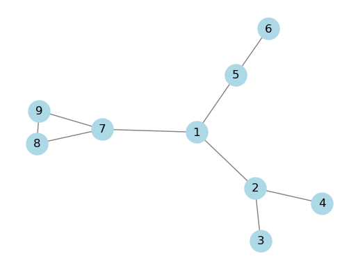
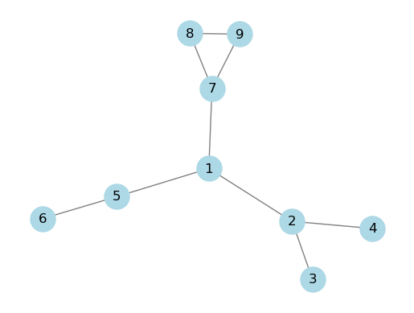

그래프는 정점(Vertex, Node)과 그들을 잇는 간선(Edge)으로 구성된 자료구조입니다. 실세계의 복잡한 연결 관계를 추상화하여 표현하는 데 널리 사용됩니다.

# 그래프 표현 방법

## 1. 인접 리스트 (Adjacency List)

각 정점에 연결된 이웃 정점들을 리스트로 관리하는 방법입니다. 공간 효율성이 좋아 희소 그래프(Sparse Graph) 표현에 유리합니다.

### Python 실습 (NetworkX 시각화)

```python
import networkx as nx
import matplotlib.pyplot as plt

adj_list = {
    1: [2, 5, 7],
    2: [1, 3, 4],
    3: [2],
    4: [2],
    5: [1, 6],
    6: [5],
    7: [1, 8, 9],
    8: [7, 9],
    9: [7, 8],
}

G = nx.Graph(adj_list)
pos = nx.spring_layout(G)

nx.draw_networkx_nodes(G, pos, node_color='lightblue', node_size=500)
nx.draw_networkx_edges(G, pos, edge_color='gray')
nx.draw_networkx_labels(G, pos, font_color='black', font_size=12)

plt.axis('off')
plt.show()
```



## 2. 인접 행렬 (Adjacency Matrix)

정점의 개수가 $V$일 때 $V \times V$ 차원 배열을 사용하여 연결 여부를 표시하는 방법입니다. 특정 두 정점의 연결 여부를 $O(1)$ 시간 내에 확인할 수 있습니다.



### 구현 특징
- **장점**: 구현이 단순하며 간선 정보 조회가 매우 빠름.
- **단점**: 정점 수에 비해 간선이 적을 경우 메모리 낭비가 큼($O(V^2)$).

---

## Reference

- [그래프 (Wikipedia)](https://ko.wikipedia.org/wiki/%EA%B7%B8%EB%9E%98%ED%94%84_(%EC%9E%90%EB%A3%8C_%EA%B5%AC%EC%A1%B0))
- [Graph abstract data type (Wikipedia)](https://en.wikipedia.org/wiki/Graph_(abstract_data_type))
