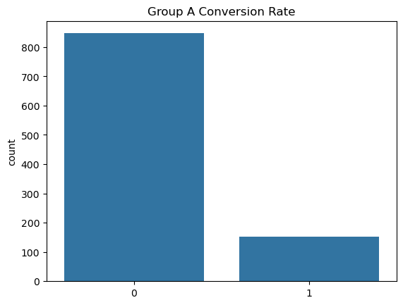
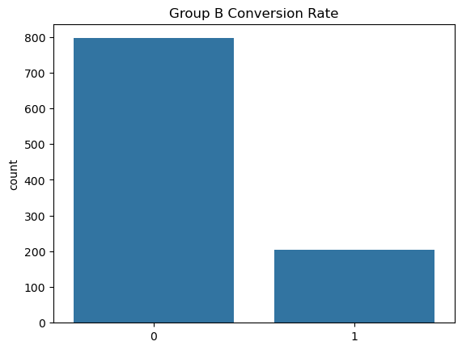

A/B 테스트(버킷 테스트, 분할-실행 테스트)는 두 가지 다른 옵션(A와 B) 중 어느 것이 더 나은지 판단하기 위한 실험적 방법입니다. 이는 통계적 가설 검정 또는 **2-표본 가설 검정**의 한 형태입니다.

| 가정된 분포 | 예제 케이스           | 표준 테스트         | 대체 테스트      |
| ----------- | --------------------- | ------------------- | ---------------- |
| 가우시안    | 사용자 당 평균 수익   | Welch's t-test      | Student's t-test |
| 이항 분포   | 클릭률                | 피셔의 정확 검정    | 버나드 검정      |
| 푸아송 분포 | 사용자 당 트랜잭션 수 | E-검정              | C-검정           |
| 다항 분포   | 제품 개수             | 카이-제곱 검정      |                  |
| 알 수 없음  |                       | Mann–Whitney U 검정 | 깁스 샘플링      |

## 간단한 실습

````python
import matplotlib.pyplot as plt
import numpy as np
import seaborn as sns
from scipy.stats import fisher_exact

```python
sns.countplot(x=group_a)
plt.title("Group A Conversion Rate")
plt.show()

sns.countplot(x=group_b)
plt.title("Group B Conversion Rate")
plt.show()
````





---

```python
group_a_conversions = np.sum(group_a)
group_b_conversions = np.sum(group_b)
print(f"Group A conversions: {group_a_conversions}")
print(f"Group B conversions: {group_b_conversions}")
```

| 그룹    | 전환 수 |
| ------- | ------- |
| Group A | 153     |
| Group B | 204     |

---

```python
## 2x2 분할표 생성
table = np.array([
    [group_a_conversions, len(group_a) - group_a_conversions],
    [group_b_conversions, len(group_b) - group_b_conversions]
])

## 피셔의 정확 검정 수행
odds_ratio, p_value = fisher_exact(table)
print(f"Odds ratio: {odds_ratio:.2f}")
print(f"p-value: {p_value:.3f}")
```

| 결과 항목  | 값    |
| ---------- | ----- |
| Odds ratio | 0.70  |
| p-value    | 0.003 |

---

```python
if p_value < 0.05:
    print("A 그룹과 B 그룹 사이의 차이가 통계적으로 유의합니다.")
    if group_a_conversions > group_b_conversions:
        print("A 그룹의 전환율이 더 높습니다.")
    else:
        print("B 그룹의 전환율이 더 높습니다.")
else:
    print("A 그룹과 B 그룹 사이의 차이가 통계적으로 유의하지 않습니다.")
```

---

## Reference

- [A/B 테스트 (Wikipedia)](https://ko.wikipedia.org/wiki/A/B_%ED%85%8C%EC%8A%A4%ED%8A%B8)
- [A/B 테스트란 (Datarian)](https://datarian.io/blog/a-b-testing)
- [카카오페이 AB 테스트 서비스 구축기](https://tech.kakaopay.com/post/kakaopay-growth-platform-abtest/)
- [Mobile Games A/B Testing](https://www.kaggle.com/code/hakankeskin/mobile-games-a-b-testing)
- [Simple and Complete Guide to A/B Testing](https://news.lunartech.ai/simple-and-complet-guide-to-a-b-testing-c34154d0ce5a)
