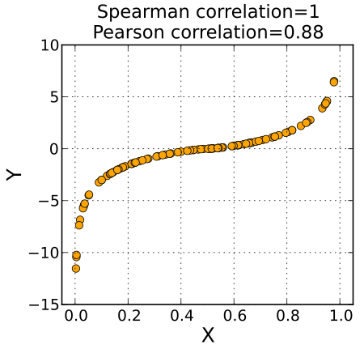
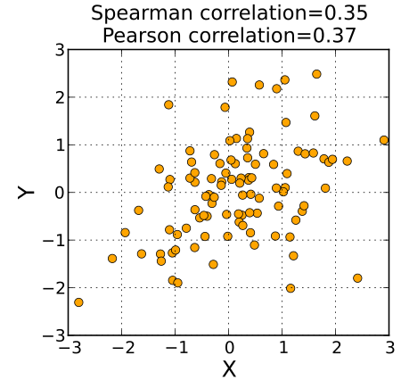
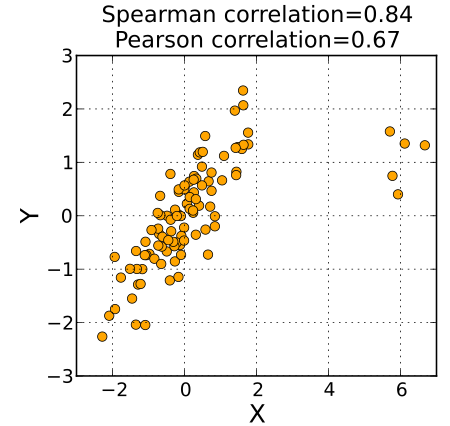

상관분석은 두 변수 간에 어떤 선형적 관계를 갖고 있는지를 분석하는 방법입니다. 두 변수가 서로 독립적인 관계인지 아니면 상관된 관계인지를 파악하고, 그 관계의 강도를 수치적으로 나타냅니다.

## 주요 개념

## 공분산 (Covariance)
두 변수가 함께 변화하는 정도를 나타내는 지표입니다.
- $Cov(X, Y) > 0$: X가 증가할 때 Y도 증가하는 경향.
- $Cov(X, Y) < 0$: X가 증가할 때 Y는 감소하는 경향.
- $Cov(X, Y) = 0$: 두 변수는 아무런 상관이 없음.

공분산은 측정 단위와 범위에 영향을 받으므로 절대적 크기로 관계의 정도를 판단하기 어렵습니다. 이를 표준화한 것이 상관계수입니다.

## 상관계수 (Correlation Coefficient)
- **범위**: -1에서 +1 사이.
- **해석**: 0에 가까울수록 관계가 없고, ±1에 가까울수록 강한 선형 관계를 의미합니다.
- **주의**: 상관관계는 인과관계를 의미하지 않습니다. 인과관계 파악을 위해서는 회귀분석이 필요합니다.

### 피어슨 상관계수 (Pearson Correlation Coefficient)
두 변수 간의 선형 상관 관계를 계량화한 수치로, 등간척도나 비율척도 데이터에 적용합니다.

### 스피어먼 상관계수 (Spearman Rank Correlation Coefficient)
두 변수의 순위 사이의 통계적 의존성을 측정하는 비모수적 척도입니다. 비선형적이지만 단조적인 관계를 평가하며 이상치에 덜 민감합니다.

| 피어슨 vs 스피어먼 비교 |
| --- | --- |
|  |
|  |
|  |

## 시각화 방법

- **산점도 (Scatter Plot)**: 두 수치형 변수의 관계를 점으로 표현.
- **육각형 구간 (Hexbin Plot)**: 데이터가 많아 점이 겹칠 때 유용.
- **히트맵 (Heatmap)**: 여러 변수 간의 상관계수를 색상으로 표현.

---

## Reference

- [상관 분석 (Wikipedia)](https://ko.wikipedia.org/wiki/%EC%83%81%EA%B4%80_%EB%B6%84%EC%84%9D)
- [피어슨 상관 계수 (Wikipedia)](https://ko.wikipedia.org/wiki/%ED%94%BC%EC%96%B4%EC%8A%A8_%EC%83%81%EA%B4%80_%EA%B3%84%EC%88%98)
- [스피어먼 상관 계수 (Wikipedia)](https://ko.wikipedia.org/wiki/%EC%8A%A4%ED%94%BC%EC%96%B4%EB%A8%BC_%EC%83%81%EA%B4%80_%EA%B3%84%EC%88%98)
- [p-value의 역설 (Insilicogen Blog)](https://www.insilicogen.com/blog/341)
- [공분산 (Mindscale)](https://mindscale.kr/course/basic-stat-python/5/)

