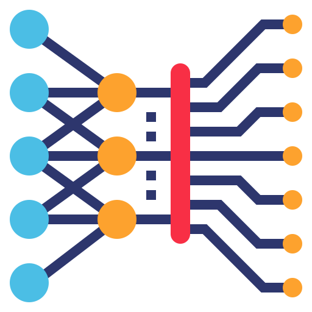
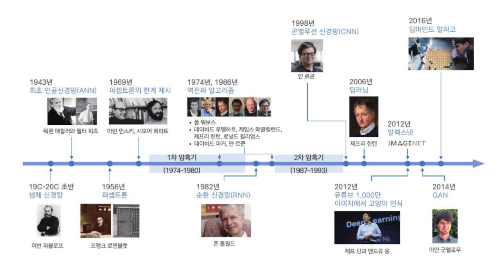
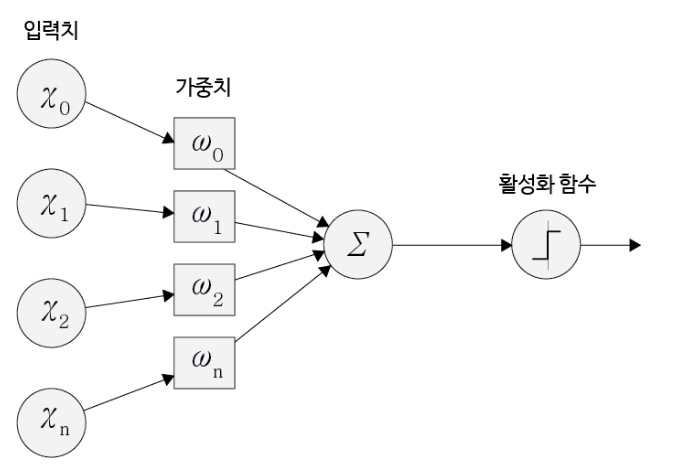

딥러닝(Deep Learning)은 여러 비선형 변환기법의 조합을 통해 높은 수준의 추상화를 시도하는 기계학습 알고리즘의 집합입니다. 여러 층을 가진 인공신경망(ANN)을 사용하여 대규모 데이터에서 중요한 패턴 및 규칙을 자동으로 학습합니다.

## ANN (Artificial Neural Network)

인공신경망은 사람의 신경망 원리 구조를 모방하여 만든 알고리즘입니다. 인간의 뉴런이 자극을 받고 임계값을 넘기면 신호를 전달하듯, 입력 데이터(Input)에 가중치(Weight)를 곱하고 활성화 함수를 통해 결과를 도출합니다.

- **문제점**: 파라미터 최적화의 어려움(Gradient Vanishing 등), 오버피팅, 느린 학습 시간. (현재는 HW의 발전과 다양한 기법으로 많이 해소됨)

## 퍼셉트론 (Perceptron)

인공신경망 이론을 설명한 최초의 알고리즘입니다.

- **단층 퍼셉트론**: 입력층과 출력층으로만 구성되어 선형 문제를 해결합니다.
- **다층 퍼셉트론 (MLP)**: 은닉층을 추가하여 복잡한 비선형 문제까지 해결 가능한 일반적인 신경망 구조입니다.

## 전이 학습 (Transfer Learning)

한 분야의 문제를 해결하기 위해 얻은 지식(네트워크 파라미터)을 다른 유사한 문제를 푸는 데 재사용하는 방식입니다. 데이터가 적은 환경에서도 빠르고 정확한 모델을 구축할 수 있게 해줍니다.

---

## Reference

- 인공신경망 (ANN) 원리 및 구조
- 전이 학습의 개념과 활용
- 소프트맥스(Softmax) 함수 vs 시그모이드(Sigmoid) 함수
