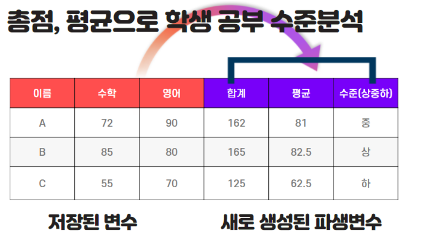

파생 변수란 기존 변수의 연산, 조합, 분해, 함수 적용 등을 통해 새롭게 생성된 변수를 의미합니다. 적절한 파생 변수 생성은 데이터 해석을 돕고 모델 성능을 향상시킬 수 있습니다.

## 주요 방법

## 다항식 전개 (Polynomial Expansion)

주어진 다항식의 차수 값에 기반하여 변수를 생성합니다. 예를 들어 `[a, b]` 피처가 있다면 차수 2에서는 `[1, a, b, a^2, ab, b^2]`와 같은 조합이 가능합니다.

- **유용성**: 머신러닝 모델이 다양한 피처에 기반하게 하여 안정성을 높이고 선형적으로 구분되지 않는 경계를 더 잘 표현할 수 있게 돕습니다.
- **주의**: 분석 단계에서는 직관성이 떨어질 수 있으나, 모델의 성능 향상(특히 과대적합 방지 보강) 목적으로 자주 사용됩니다.

---

## Reference

- [Scikit-learn: PolynomialFeatures](https://scikit-learn.org/stable/modules/generated/sklearn.preprocessing.PolynomialFeatures.html)
- 파생 변수와 요약 변수의 차이 이해
