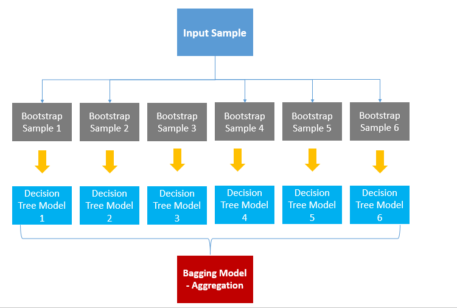
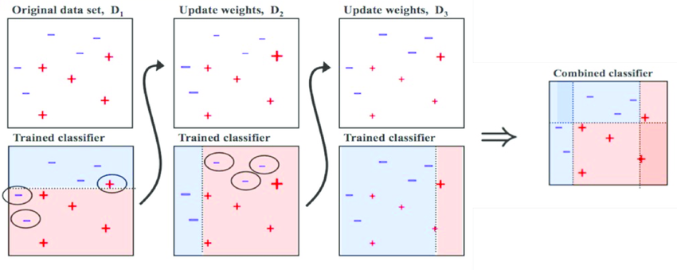
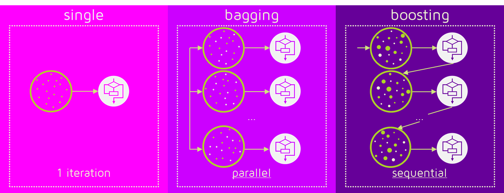

## Ensemble

앙상블은 여러 개의 기본 모델을 결합하여 더 성능이 좋고 안정적인 예측 모델을 만드는 방법입니다. 보통 하나의 모델이 가지고 있는 오류를 보완하고, 성능 향상을 목표로 합니다.

앙상블은 조화 또는 통일을 의미합니다.

어떤 데이터의 값을 예측한다고 할 때, 하나의 모델을 활용합니다. 하지만 여러 개의 모델을 조화롭게 학습시켜 그 모델들의 예측 결과들을 이용한다면 더 정확한 예측값을 구할 수 있을 겁니다.

앙상블 학습은 여러 개의 결정 트리(Decision Tree)를 결합하여 하나의 결정 트리보다 더 좋은 성능을 내는 머신러닝 기법입니다. 앙상블 학습의 핵심은 여러 개의 약 분류기 (Weak Classifier)를 결합하여 강 분류기(Strong Classifier)를 만드는 것입니다. 그리하여 모델의 정확성이 향상됩니다.

앙상블 학습법에는 두 가지가 있습니다. 배깅(Bagging)과 부스팅(Boosting)입니다. 이를 이해하기 위해서는 부트스트랩(Bootstrap)과 결정 트리(Deicison Tree)에 대한 개념이 선행되어야 합니다.

## Bagging (배깅, Bootstrap Aggregating)

- 배깅은 훈련 데이터셋을 복원 추출 방식으로 여러 개의 서브셋(subset)으로 분할하여 각각의 모델을 훈련시킵니다. 독립적인 모델들의 예측값들을 집계(aggregating)하여 최종 결과를 얻습니다. 주로 투표(voting) 또는 평균을 사용하여 결과를 집계합니다.
  - 장점: 전체 데이터를 사용한 단일 모델보다 오버피팅(과적합)을 줄일 수 있음
  - 예제: 랜덤 포레스트(Random Forest)는 의사 결정 트리(Decision Tree)를 기본 모델로 사용하여 배깅 방식을 적용한 알고리즘입니다.

Bagging은 Bootstrap Aggregation의 약자입니다. 배깅은 샘플을 여러 번 뽑아(Bootstrap) 각 모델을 학습시켜 결과물을 집계(Aggregration)하는 방법입니다. 아래 그림을 보겠습니다.

출처: swallow.github.io

우선, 데이터로부터 부트스트랩을 합니다. (복원 랜덤 샘플링) 부트스트랩한 데이터로 모델을 학습시킵니다. 그리고 학습된 모델의 결과를 집계하여 최종 결과 값을 구합니다.

Categorical Data는 투표 방식(Votinig)으로 결과를 집계하며, Continuous Data는 평균으로 집계합니다.

Categorical Data일 때, 투표 방식으로 한다는 것은 전체 모델에서 예측한 값 중 가장 많은 값을 최종 예측값으로 선정한다는 것입니다. 6개의 결정 트리 모델이 있다고 합시다. 4개는 A로 예측했고, 2개는 B로 예측했다면 투표에 의해 4개의 모델이 선택한 A를 최종 결과로 예측한다는 것입니다.

평균으로 집계한다는 것은 말 그대로 각각의 결정 트리 모델이 예측한 값에 평균을 취해 최종 Bagging Model의 예측값을 결정한다는 것입니다.

배깅은 간단하면서도 파워풀한 방법입니다. 배깅 기법을 활용한 모델이 바로 랜덤 포레스트입니다.

## Boosting (부스팅)

- 부스팅은 기본 모델들을 순차적으로 훈련하여 이전 모델의 오류를 보완하는 방식으로 진행됩니다. 훈련 데이터에서 오류 발생을 줄이도록 가중치를 조절하며 학습됩니다.
  - 장점: 모델의 복잡도가 낮고, 성능이 높아짐
  - 예제: 에이다부스트(AdaBoost)는 이전 모델에서의 오류 샘플에 가중치를 높여 다음 모델이 잘 분류할 수 있도록 도와주며, 그래디언트 부스팅(Gradient Boosting)은 이전 모델의 오차를 최소화하는 방향으로 모델을 학습시킵니다.

부스팅은 가중치를 활용하여 약 분류기를 강 분류기로 만드는 방법입니다. 배깅은 Decision Tree1과 Decision Tree2가 서로 독립적으로 결과를 예측합니다. 하지만 부스팅은 모델 간 팀워크가 이루어집니다. 처음 모델이 예측을 하면 그 예측 결과에 따라 데이터에 가중치가 부여되고, 부여된 가중치가 다음 모델에 영향을 줍니다. 잘못 분류된 데이터에 집중하여 새로운 분류 규칙을 만드는 단계를 반복합니다. 아래 그림을 통해 설명해보겠습니다.

출처: Medium (Boosting and Bagging explained with examples)

+와 -로 구성된 데이터셋을 분류하는 문제입니다.

D1에서는 2/5 지점을 횡단하는 구분선으로 데이터를 나누어주었습니다. 하지만 위쪽의 +는 잘못 분류가 되었고, 아래쪽의 두 -도 잘못 분류되었습니다. 잘못 분류가 된 데이터는 가중치를 높여주고, 잘 분류된 데이터는 가중치를 낮추어 줍니다.

D2를 보면 D1에서 잘 분류된 데이터는 크기가 작아졌고(가중치가 낮아졌고) 잘못 분류된 데이터는 크기가 커졌습니다.(가중치가 커졌습니다.) 분류가 잘못된 데이터에 가중치를 부여해주는 이유는 다음 모델에서 더 집중해 분류하기 위함입니다. D2에서는 오른쪽 세 개의 -가 잘못 분류되었습니다.

따라서 D3에서는 세 개의 -의 가중치가 커졌습니다. 맨 처음 모델에서 가중치를 부여한 +와 -는 D2에서는 잘 분류가 되었기 때문에 D3에서는 가중치가 다시 작아졌습니다.

D1, D2, D3의 Classifier를 합쳐 최종 Classifier를 구할 수 있습니다. 최종 Classfier는 +와 -를 정확하게 구분해줍니다.

## Stacking (스태킹)

- 스태킹은 여러 개의 기본 모델로부터 얻은 예측 값을 다시 사용하여 새로운 특성(feature)으로 활용하는 방식입니다. 이렇게 얻은 새로운 특성 데이터를 메타 모델(meta-model)에 투입하여 학습시킵니다.
- 장점: 다양한 모델들의 강점을 활용하여 성능 향상을 추구

## 배깅과 부스팅 차이

출처: swallow.github.io

위 그림에서 나타내는 바와 같이 배깅은 병렬로 학습하는 반면, 부스팅은 순차적으로 학습합니다. 한번 학습이 끝난 후 결과에 따라 가중치를 부여합니다. 그렇게 부여된 가중치가 다음 모델의 결과 예측에 영향을 줍니다.

오답에 대해서는 높은 가중치를 부여하고, 정답에 대해서는 낮은 가중치를 부여합니다. 따라서 오답을 정답으로 맞추기 위해 오답에 더 집중할 수 있게 되는 것입니다.

부스팅은 배깅에 비해 error가 적습니다. 즉, 성능이 좋습니다. 하지만 속도가 느리고 오버 피팅이 될 가능성이 있습니다. 상황에 따라 다르다고 할 수 있습니다. 개별 결정 트리의 낮은 성능이 문제라면 부스팅이 적합하고, 오버 피팅이 문제라면 배깅이 적합합니다.

---

## Reference

- [[머신러닝] 앙상블 학습 - 1) 배경](https://sungkee-book.tistory.com/8)
- [Boosting and Bagging explained with examples (Medium)](https://medium.com/@albert_m/boosting-and-bagging-explained-with-examples-5fdb6d3e6cb)
