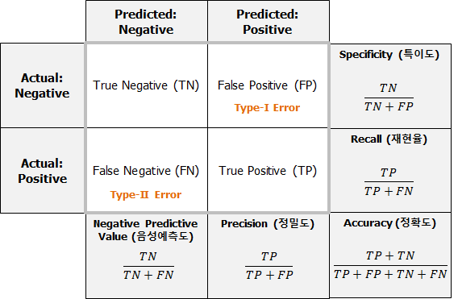

성능 평가 지표는 모델의 예측 결과가 실제 데이터와 얼마나 일치하는지를 수치로 나타낸 것입니다. 문제의 성격(분류 또는 회귀)에 따라 적절한 지표를 선택해야 합니다.

## 분류 모델 지표 (Classification)

## 혼동 행렬 (Confusion Matrix)

모델의 진단 및 예측 능력을 평가하기 위한 표입니다.

- **Accuracy (정확도)**: 전체 중 맞게 예측한 비율.
- **Precision (정밀도)**: Positive로 예측한 것 중 실제 Positive 비율.
- **Recall (재현율)**: 실제 Positive 중 Positive로 예측한 비율.
- **F1 Score**: 정밀도와 재현율의 조화 평균.
- **ROC Curve**: 모델의 판별 능력을 시각화한 곡선.

## 회귀 모델 지표 (Regression)

- **MAE (Mean Absolute Error)**: 절대 오차의 평균.
- **MSE (Mean Squared Error)**: 오차 제곱의 평균.
- **RMSE (Root Mean Squared Error)**: MSE에 루트를 씌운 값.
- **MAPE (Mean Absolute Percentage Error)**: 오차율의 평균.
- **RMSLE (Root Mean Squared Logarithmic Error)**: 로그 변환을 적용한 오차.

---

## Reference

- 사이킷런을 활용한 머신러닝 성능 평가
- 모델 평가 및 선택 가이드
