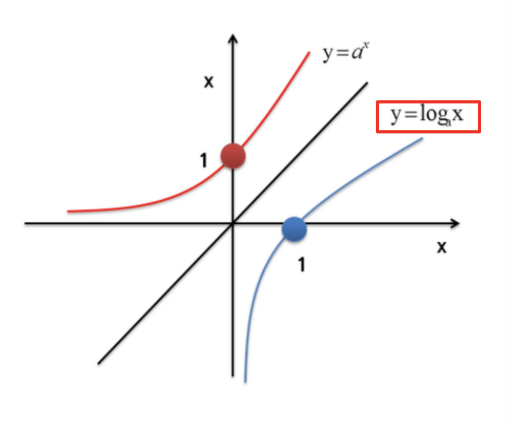

로그 변환은 데이터의 분포가 한쪽으로 치우쳐 있거나 불규칙할 때, 이를 표준정규분포에 가까운 형태로 변형하기 위해 사용되는 기법입니다.

## 로그를 사용하는 이유

1. **큰 수의 압축**: 아주 큰 값을 상대적으로 작은 범위로 압축합니다.
2. **연산 단순화**: 지수 연산을 덧셈으로 바꾸어 복잡한 계산을 용이하게 합니다.
3. **왜도(Skewness)와 첨도(Kurtosis) 감소**: 데이터 분포의 비대칭성을 줄여 통계적 분석 결과의 신뢰도를 높입니다.
4. **의미 있는 결과 도출**: 분석 시 극단값(Outlier)의 영향을 줄이고 일반적인 패턴을 찾기 쉽게 합니다.

## 주의사항

- **Zero/Negative values**: 로그 함수는 0이나 음수에 대해 정의되지 않습니다. 따라서 데이터에 0이 포함된 경우 `numpy.log1p()`($log(x+1)$)를 주로 사용합니다.
- **Scaling vs Transformation**: 데이터 스케일링(Scaling)은 값의 범위만 바꾸지만, 로그 변환은 데이터의 **기존 분포 자체를 변경**한다는 차이점이 있습니다.

---

## Reference

- [NumPy log1p documentation](https://numpy.org/doc/stable/reference/generated/numpy.log1p.html)
- 데이터 전처리를 위한 로그 변환 가이드
