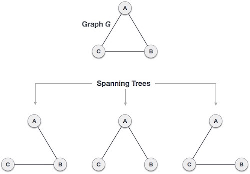

신장 트리(Spanning Tree)란 원본 그래프의 모든 노드를 포함하면서, 사이클(Cycle)이 존재하지 않는 부분 그래프(Sub-graph)를 의미합니다.

> [!NOTE]
> 트리(Tree)는 사이클이 없는 연결된 무방향 그래프로 정의됩니다.

# 주요 특징

1. **모든 노드 포함**: 원본 그래프 $G$의 모든 정점이 신장 트리에 포함되어야 합니다.
2. **사이클 없음**: 트리 구조이므로 순환 경로가 존재하지 않습니다.
3. **최소 간선 수**: 정점이 $n$개일 때, 신장 트리의 간선 수는 항상 $n-1$개입니다.
4. **연결성 유지**: 트리를 구성하는 모든 노드 사이에는 항상 경로가 존재합니다.

## 활용 분야
- 네트워크 설계: 모든 지점을 가장 효율적으로(최소 비용으로) 연결할 때 사용합니다. (예: 최소 신장 트리 - MST)
- 통신로 구축: 불필요한 루프를 방지하면서 모든 단말기를 연결하는 논리적 경로 설정에 활용됩니다.

---

## Reference

- [Spanning tree (Wikipedia)](https://en.wikipedia.org/wiki/Spanning_tree)
- [신장 부분 그래프 (Wikipedia)](https://ko.wikipedia.org/wiki/%EC%8B%A0%EC%9E%A5_%EB%B6%80%EB%B6%84_%EA%B7%B8%EB%9E%98%ED%94%84)
- [[Python] 크루스칼(Kruskal) 알고리즘을 이용한 MST 찾기](https://techblog-history-younghunjo1.tistory.com/262)
