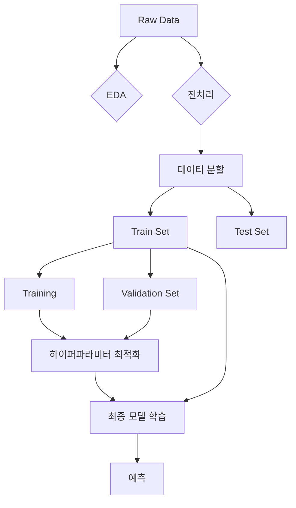

# 빅데이터분석기사 실기 대비

빅데이터분석기사 실기 시험을 위한 공부 내용을 정리합니다.

## 머신러닝 워크플로우

## 주요 유형별 체크

1. **유형 1**: 데이터 핸들링 및 전처리
2. **유형 2**: 머신러닝 모델링 (분류/회귀)
3. **유형 3**: 통계적 가설 검정

---

## Reference
- [빅데이터분석기사 실기 체험환경](https://dataq.goorm.io/exam/3/체험하기/quiz/1)
- [DataManim](https://www.datamanim.com/intro.html)
- [Big Data Certification KR (Kaggle)](https://www.kaggle.com/datasets/agileteam/bigdatacertificationkr)
