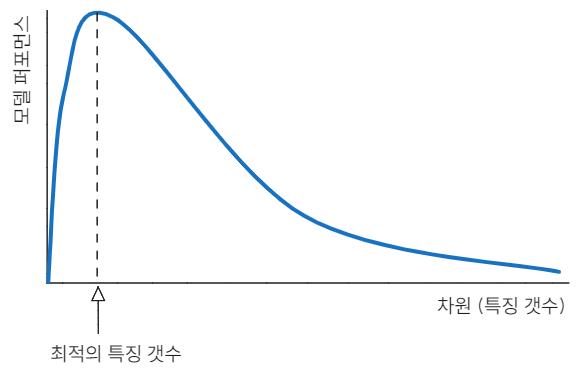

차원의 저주(Curse of Dimensionality)는 저차원 환경에서는 발생하지 않는, 고차원 공간에서 데이터를 분석하고 정리할 때 발생하는 다양한 현상을 말합니다.

## 주요 현상

### 1. 희소성 문제 (Sparsity Problem)

차원이 증가하면 공간의 부피가 기하급수적으로 커져 데이터가 희소(sparse)해집니다. 대부분의 값이 0이거나 비어 있는 상태가 되어 모델이 패턴을 학습하기 어려워집니다.

### 2. 휴즈 현상 (Hughes Phenomenon)

차원이 증가하면 초기에는 모델 성능이 향상되지만, 일정 임계치를 초과하면 오히려 성능이 저하되는 현상입니다.

### 3. 거리 집중 현상 (Concentration of Distances)

고차원 공간에서 모든 데이터 포인트 간의 거리가 거의 일정해지는 현상입니다. 이로 인해 KNN 같은 거리 기반 알고리즘의 성능이 급격히 저하됩니다. 데이터들이 하이퍼큐브의 중심보다는 모서리나 표면에 집중되는 경향을 보입니다.

## 문제점 및 해결 방안

- **문제점**: 과적합(Overfitting) 위험 증가, 거리 기반 모델 성능 저하.
- **해결 방안**:
  - **차원 축소 (Dimensionality Reduction)**: 특성 선택(Feature Selection) 또는 특성 추출(Feature Extraction - PCA 등).
  - **모델 선택**: 트리 기반 모델 등 차원에 덜 민감한 모델 사용.
  - **정규화 (Normalization)**: 데이터 스케일 조정.

---

## Reference

- [Curse of dimensionality (Wikipedia)](https://en.wikipedia.org/wiki/Curse_of_dimensionality)
- [차원의 저주 (Wikipedia)](https://ko.wikipedia.org/wiki/%EC%B2%B4%EC%9B%90%EC%9D%98_%EC%A0%80%EC%A3%BC)
- [차원의 저주 (모두의연구소 블로그)](https://modulabs.co.kr/blog/%EC%B0%A8%EC%9B%90%EC%9D%98-%EC%A0%80%EC%A3%BC-curse-of-dimensionality)
