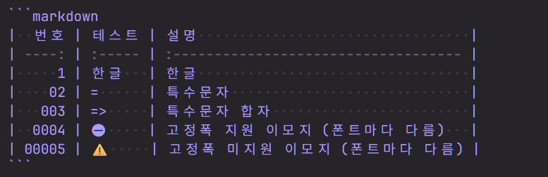

## CodexMono

> Strict Monospace Variable Font for AI-CLIs
> Set of Hermes, meaning "The Messenger's Font Set", includes Nerd Fonts & Emoji

- Homepage, Download: <https://monolex.ai/with/codexmono/>
- Repository, Details: <https://github.com/monolex/codexmono>

---

## 한글 지원 고정폭 글꼴

윈도우의 기본 고정폭 글꼴의 한글은 굉장히 읽기 불편했다. 해상도가 다른거처럼 자글자글하다. 그렇다고 한글을 쓰지 않기에는 한글의 가독성, 모국어라는 장점이 너무 크다. 그래서 고정폭 폰트를 고를 때, 한글 지원을 최우선으로 고려하게 되었다.

## 사용 경험

한글을 지원한다고 모든 글꼴이 만족스럽지는 않았다.

1. 알파벳과 한글의 글자폭 비율이 1:2이 아닌 경우
1. 알파벳의 글자폭이 너무 좁아서 코드를 읽기 불편한 경우
1. 특수 문자 합자를 지원하지 않는 경우

이런 경험들은 한글 지원을 포함하여 글꼴 선택의 체크리스트가 되었다. 여러 환경과 상황에서 사용하기 편한 폰트들의 특징들이라고 생각한다.

- [ ] 한글 지원
- [ ] 알파벳과 한글 폭 비율이 1:2일 것
- [ ] 알파벳이 지나치게 좁지 않을 것
- [ ] 특수문자 합자 지원

추가로 아래는 있으면 좋은 기능들이었다.

- [ ] Nerd Font 지원
- [ ] 고정폭 이모지 지원

### 사용해온 글꼴들

- [**D2 Coding**](https://github.com/naver/d2codingfont): 한글 코딩 폰트의 대표적인 글꼴. 하지만, 알파벳 글자폭이 너무 좁아서 가독성이 나빳다.
- **영어 고정폭 글꼴 + 한글 고정폭 글꼴**: 적절한 조합을 찾기가 어려웠다. 글자가 서로 어울려야한다. 글자 폭이 완벽한 1:2을 찾는건 어려웠다. 4\~8 글자는 잘 맞는거 같았지만 60\~100 자에서 어긋났다.
- [**구름 산스 코드**](https://goorm-sans.goorm.io/): 알파벳과 한글의 글자폭 비율이 2:3이라서 가독성이 뛰어났다. 하지만, 터미널, 마크다운 테이블 등의 상황에서 불편했다. 그래도 가독성이 뛰어나서 Nerd Font를 적용한 [**GoormSansCodeNerdFont**](https://gist.github.com/soomtong/1c548801bea7b93a29d421b27e5621ad)를 오래 사용했다.
- [**JetBrainsMonoHangul**](https://github.com/Jhyub/JetBrainsMonoHangul): 나무위키에서 알게 되었고, 최근까지 잘 사용했다. 고정폭 이모지를 제외하고 모든 체크리스트에 부합했다.

## CodexMono KR Hermes

**CodexMono KR Hermes**는 모든 이모지는 아니지만, 자주 사용되는 이모지들의 고정폭을 지원한다. 여러 개발환경 특히, CLI에서 사용하기 편리했다.

